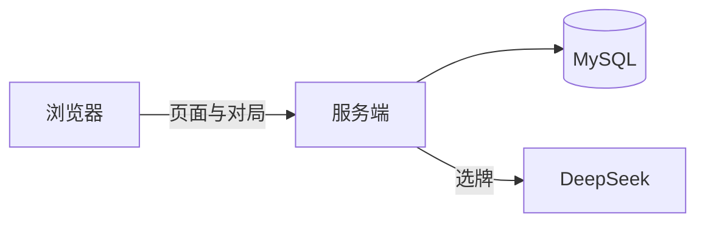

# AI-Doudizhu

网页上玩的三人斗地主。打开浏览器即可登录、建房、叫地主、出牌。一桌可以连续打若干局并累计得分。发牌时会请大模型从几种洗牌结果里挑一副，减少「有人毫无游戏体验」的情况。

## 快速开始

需要安装 Docker。仓库里的配置都是示例，真正跑之前先复制再改：

```bash
cp config.example.ini config.ini
```

打开 `config.ini`，在 `[DEEPSEEK]` 里填入自己的 API Key。然后在仓库根目录执行：

```bash
bash ops-scripts/local_run.sh
```

它会构建并拉起服务端和数据库。第一次启动数据库可能要等一会儿。浏览器访问 <http://127.0.0.1:23401>。预置账号 `p1`、`p2`、`p3`，密码都是 `123456`。三个号进入同一房间即可开打。

清掉本机容器和数据：

```bash
bash ops-scripts/local_clean.sh
```

`config.ini` 含密钥，不会进 git。

## 部署到服务器

先复制远程环境示例：

```bash
cp ops-scripts/env.example.sh ops-scripts/env.sh
```

填入 SSH 地址、端口和远端目录。本机仍用上面的 `config.ini` 构建镜像。然后：

```bash
bash ops-scripts/push.sh    # 构建、打包、上传
bash ops-scripts/start.sh   # 在远端载入镜像并启动
bash ops-scripts/stop.sh    # 在远端停止
```

## 功能

登录后可以创建房间（自定打几局）或按房间名、房间号搜索加入。三人到齐并点准备后开局。规则是常见的叫抢地主、加倍、出牌；春天会再翻一倍。每一小局结束先看本局得分，整桌约定的局数打完后进入总分榜。

有人短暂掉线时会占座等待重连；多次等不到或有人主动离开，本桌作废，分数清掉。

发牌时服务端先随机洗出五副，交给 DeepSeek 选一副：尽量避开过于极端的牌（例如一家几乎没有 2、王和炸弹，另一家同时握着火箭和炸弹），在「能正常打」和「场面比较热闹」之间轮换，大约十来局允许出现一次很偏的牌。五副都不理想时也必须从中挑一副，不会推倒重来。选出后再按当前总分分给三家——分差不大就随机，领先较多的人拿到相对弱一些的手牌。第一局需要等这一步；从第二局起，会在打牌过程中后台准备下一局的牌，多数时候点准备后马上就能开。无人叫地主而流局时会重新选牌，不会拿已经为下一局准备好的牌来重发。

日志在容器 `/app/log/` 下分成三个文件：服务运行、玩家操作（不含密码）、发给模型的牌和它的回复。

## 架构

浏览器只提供界面。C++ 服务端处理登录、房间和对局，账号存在 MySQL。选牌时请求 DeepSeek。Docker 里跑服务和数据库两个容器。



构建时把程序、网页、配置收进同一份 `deploy/` 目录，镜像运行阶段整份拷成 `/app`，不再东一块西一块地拷文件。进程默认按可执行文件的位置去找旁边的配置，所以本机产物和容器里的布局是同一套。

问模型选牌可能要十几秒到一分钟。评估放在后台线程里做，做完再回到网络线程里发牌，避免整站在等人时连进出房间、出牌都卡住。从第二局起，当前局一开始就在后台准备下一局；这时牌还没分给谁，真正开局再按当时的总分来分——分差不大就随机，领先较多的人拿相对弱的一手。流局是同一小局的重发，不会误用这份「下一局」的牌。一次只交给模型五副、必须从中选出，失败就用第一副，不会否掉重洗把玩家晾得更久。

发给模型的说明词单独放在文本文件里，和配置放在同一目录，改选牌口味不必改程序、也不必重新发明一套配置格式。玩家操作和模型往来拆成不同日志，查登录、出牌时不必翻五副牌的原文。掉线占座也走同一套房间状态，重连回来仍是原来的座位和牌，而不是另开一桌。
